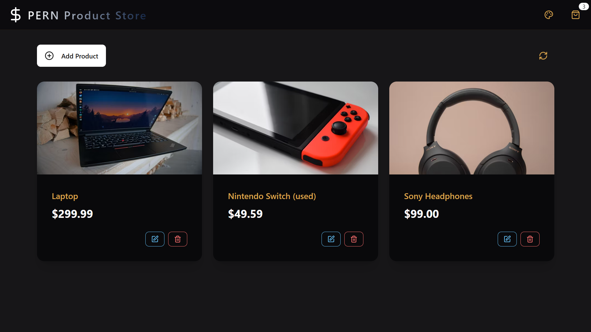
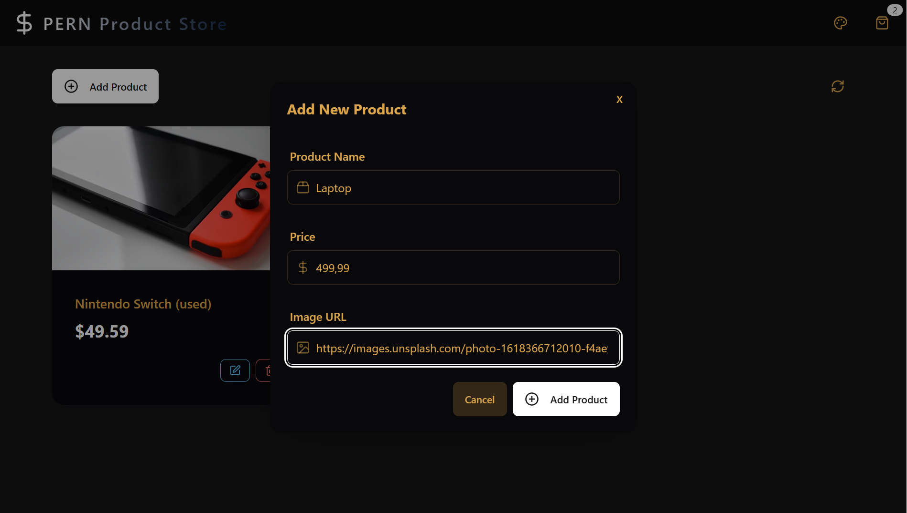
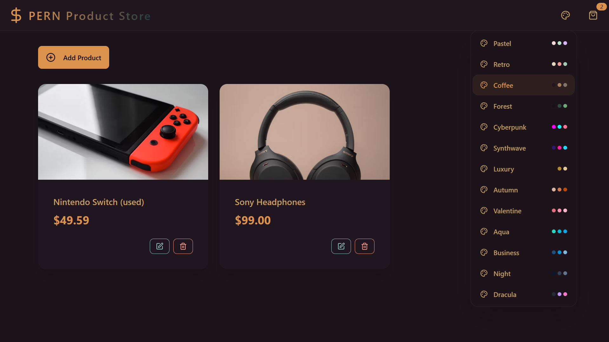

# PERN Product Store

[](https://react.dev) [](https://expressjs.com) [](https://www.postgresql.org) [](https://opensource.org/licenses/ISC)

A compact PERN (Postgres · Express · React · Node) example store built for learning and rapid prototyping. The backend exposes a small products API and the frontend is a Vite + React app using Tailwind/DaisyUI.

## Project snapshot





## What’s included

- Backend: Express server at `backend/server.js`, uses Arcjet rate protection, Helmet, CORS and Morgan for logging. Creates a `products` table on startup if missing.
- Database: SQL client configured in `backend/config/db.js` (uses tagged templates with `sql`).
- Frontend: Vite + React app in `frontend/` with routes for product listing and product details (`src/App.jsx`, `src/pages`).
- Seed data: `backend/seeds/products.js` for initial product entries.

## Quick start (development)

Prerequisites

- Node.js (recommended >= 18)
- npm
- PostgreSQL

1. Install (from project root)

```powershell
npm install
npm install --prefix frontend
```

2. Environment

Create a `backend/.env` file. Example values used by this project:

```env
PORT=3000

PGUSER=YOUR-INFO
PGPASSWORD=YOUR-INFO
PGHOST=YOUR-INFO
PGDATABASE='neondb' #Uses neondb for hosted db and PostgreSQL

ARCJET_KEY=YOUR-ARCJET-KEY
ARCJET_ENV=development

NODE_ENV=development
```

4. Run the app (dev)

Open two terminals:

Terminal A — start backend

```powershell
npm run dev
```

Terminal B — start frontend

```powershell
npm --prefix frontend run dev
```

By default the backend listens on the port defined in `backend/.env` or `3000`. Vite will typically run on `http://localhost:5173` unless otherwise configured.

## API (Products)

Base: /api/products

- GET /api/products — list all products
- GET /api/products/:id — get a single product
- POST /api/products — create product (expects JSON: { name, price, image })
- PUT /api/products/:id — update product
- DELETE /api/products/:id — delete product

See `backend/controllers/productController.js` for implementation details.

## Build for production

1. Build frontend

```powershell
npm --prefix frontend run build
```

2. Start backend (it serves frontend when NODE_ENV=production)

```powershell
npm start
```

## Useful scripts (root package.json)

- npm run dev — runs `nodemon backend/server.js` (backend dev)
- npm run build — installs deps and builds frontend
- npm start — runs `node backend/server.js`

## Notes & assumptions

- This README was generated from the current project files. I assumed the API base is `/api` and the frontend uses `VITE_API_URL` to target the backend in dev. If your environment variable names differ, update the `.env` files and the frontend constants (`frontend/src/constants`).
- Example images in the README reference `frontend/public/example-*.png`. If those files don't exist yet, add them (or update the paths) to show real screenshots.

## Next steps / recommended improvements

- Add a `backend/README.md` describing environment variables and database setup (migrations or seeds).
- Add simple tests for API endpoints (Jest + supertest) and a CI workflow.
- Add a script that runs `backend/seeds/products.js` to populate the DB automatically.

## Thanks for Reading
- Medc-0

